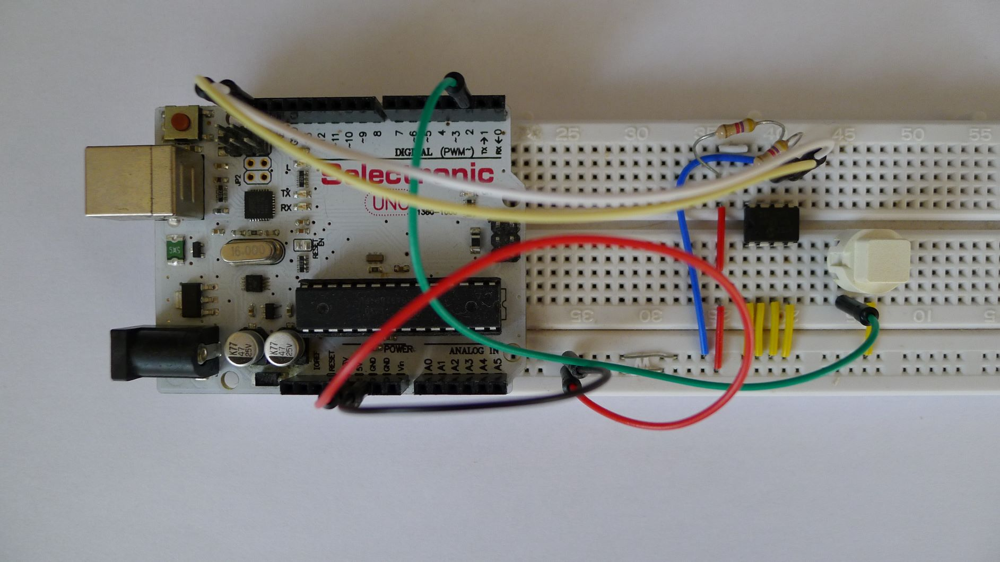

# FV-1 eeprom tools

Tools to dump and program FV-1 presets with 24LC32A eeprom.

## Arduino

1x breadboard
1x Ardiuno
2x 4.7K pullup resitors
1x push button



Install the Sparkfun External EEPROM library and the Ace button library (available via the library manager).

## Dump presets

Open the serial monitor and click on the button to dump the eeprom.
Presets are output as C arrays.

```
const uint8_t preset0[] PROGMEM = {
0x80, 0x40, 0x00, 0x11, 0x01, 0x90, 0x0C, 0x92, 0x48, 0x00, 0x00, 0x12, 0x40, 0x00, 0x02, 0x04,
[...]
};
```

## Write presets

Use SpinASM to produce a hex file (Open project dialog - populate the presets with source files - tick 'Intel hex' - Build) of the presets.

Use `hex2c.py -x myfile.hex` to transform Intel Hex format to C arrays.

Open the reader.ino project and copy/paste the effects C array definitions in `effects.h` (don't forget to rename the preset).

Insert function calls to build the presets ROM:

```
writepreset(0, myeffect1, PRESETLEN);
writepreset(0, myeffect2, PRESETLEN);
```

Upload the project to the Arduino and press long the button.

## Links

[List of SpinASM code for guitar effects pedals and other applications](https://mstratman.github.io/fv1-programs/)

## Licence

Zero-Clause BSD
Permission to use, copy, modify, and/or distribute this software for any purpose with or without fee is hereby granted.

THE SOFTWARE IS PROVIDED "AS IS" AND THE AUTHOR DISCLAIMS ALL WARRANTIES WITH REGARD TO THIS SOFTWARE INCLUDING ALL IMPLIED WARRANTIES OF MERCHANTABILITY AND FITNESS. IN NO EVENT SHALL THE AUTHOR BE LIABLE FOR ANY SPECIAL, DIRECT, INDIRECT, OR CONSEQUENTIAL DAMAGES OR ANY DAMAGES WHATSOEVER RESULTING FROM LOSS OF USE, DATA OR PROFITS, WHETHER IN AN ACTION OF CONTRACT, NEGLIGENCE OR OTHER TORTIOUS ACTION, ARISING OUT OF OR IN CONNECTION WITH THE USE OR PERFORMANCE OF THIS SOFTWARE.

Example presets are under the Spin Semiconductor Open Reverb License.


